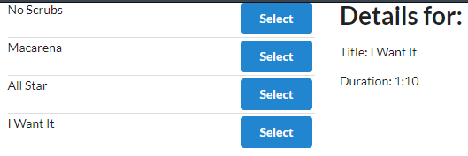

# _Redux
Some application to learn Redux

# Apps

### 1. Redux

> A list with songs, that are stored in with Redux
> On a click select, we get some more information about
>
> 
>
### 2. Redux
> Here we have 100 comments from random users. The information is provided by Json Placeholder api. All data manipulations are done with Redux and React-Redux. Also, I have used Redux-Thunk middleware.
> 
>
>

### Cheat sheet

